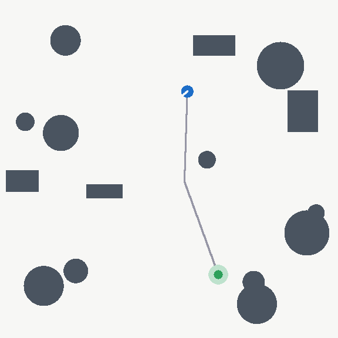

# Learning Vision-Conditioned Navigation Policies

### A comparative study against classical planning

| Classical (A* + pure pursuit) | PPO (privileged) |
|---|---|
|  |  |

*The same three unseen test worlds, solved by both. Grey: the global plan
(classical only — the learned policy has no plan to draw). Orange: the
executed trajectory.*

---

A reinforcement-learning navigation agent, a classical planning stack, and a
protocol strict enough that comparing them means something.

The question is not "can an RL agent reach a goal" — it is **where a learned
policy beats a strong classical planner, where it loses, and how each one
degrades when the world stops looking like the training set.** Every design
decision below follows from wanting that comparison to be trustworthy.

## Status

| Stage | State |
|---|---|
| Task definition, world generation, metrics, test suite | Done |
| Classical baseline (A* + pure pursuit, full map access) | Done |
| Privileged RL (PPO on pose + ranges) | Done — 1.5M steps, val SPL 0.894 |
| Robustness suite across shifted environments | Done — first results in |
| Domain randomisation over shifts | Next (see result below) |
| Vision-conditioned RL (egocentric observations + CNN) | After that |

Detail and rationale: [`docs/project_plan.md`](docs/project_plan.md).

## Results

100 held-out worlds per condition. All actors see **identical worlds in
identical order**, so rows are directly comparable. `nominal` is the
in-distribution held-out split; the rest are distribution shifts never seen in
training. Success rate / SPL:

| Condition | Classical | PPO (privileged) | Random |
|---|---|---|---|
| nominal | **1.000** / 0.985 | 0.960 / 0.910 | 0.000 / 0.000 |
| sparse | **1.000** / 1.000 | 0.980 / 0.963 | 0.010 / 0.009 |
| large | **1.000** / 0.990 | 0.970 / 0.940 | 0.000 / 0.000 |
| noisy_lidar | 1.000 / 0.985 * | 0.970 / 0.919 | 0.000 / 0.000 |
| dense | **0.890** / 0.841 | 0.640 / 0.593 | 0.000 / 0.000 |
| narrow | **0.850** / 0.795 | 0.600 / 0.556 | 0.000 / 0.000 |

\* `noisy_lidar` is a no-op for the classical planner *by construction* — it
navigates from the map and never reads the lidar. That row is non-exposure,
not robustness.

Full table: [`results/benchmark.md`](results/benchmark.md).

### The headline result is a negative one

The project's stated hypothesis was that a reactive learned policy, not
committed to a precomputed path, should close the classical planner's
weakness. That weakness was measured precisely: under `dense` and `narrow`,
**A\* never once fails to find a route** — 0 planning failures, with 9/11 and
12/15 of failures being the controller losing the plan while cornering.

**The hypothesis is falsified.** The classical planner wins on every
condition, and the gap *widens* exactly where the learned policy was predicted
to win — RL falls from 0.960 to 0.640 (`dense`) and 0.600 (`narrow`), while
classical only falls to 0.890 and 0.850.

The honest reading, and the caveat that governs it: **the policy was trained
only on the `nominal` distribution, while the classical planner has no
training distribution at all.** So these rows compare an in-distribution
planner against an out-of-distribution policy. The shifts are not "shifts" for
a search-based method. That asymmetry is inherent to comparing a learned
system with a non-learned one, and it is the finding — learned navigation
bought nothing here *and* gave up graceful degradation.

Two things the learned policy does win on, both small and stated with their
caveats:

- **Path efficiency on successful episodes.** 152 vs 161 mean steps in
  `nominal` (~6% faster). Mildly flattered by survivorship — it succeeds on
  96% of episodes to classical's 100%.
- **Sensor noise.** 0.10 m lidar range noise moves it 0.960 → 0.970, i.e. not
  at all. Within sampling noise on 100 episodes, but it is the one axis where
  the classical baseline cannot be compared at all.

The obvious next experiment, and the one the result argues for: **domain
randomisation over the shifts during training.** If the gap under `dense` and
`narrow` is OOD brittleness rather than a ceiling on reactive control,
training across the shift distribution should close most of it. Until that is
run, "RL loses" is a claim about this training regime, not about learned
navigation.

One caveat stated up front: `noisy_lidar` leaves the classical baseline
untouched, because it navigates from the map and never reads the lidar. That
row is non-exposure, not robustness.

## Quickstart

```bash
python -m venv .venv && .venv/Scripts/activate   # Linux/macOS: source .venv/bin/activate
pip install -e ".[dev,viz]"
pytest
```

Evaluate the classical baseline on held-out worlds:

```bash
python -m vision_nav.training.evaluate --actor classical --split test --episodes 100
```

Check the training pipeline end to end (about two minutes, CPU):

```bash
python -m vision_nav.training.train --config-name smoke
```

Train the privileged-RL agent properly:

```bash
python -m vision_nav.training.train
```

Run the full comparison matrix and write the results table:

```bash
python scripts/run_benchmark.py --rl runs/ppo_privileged/best_model.zip
```

Render a demo GIF:

```bash
python scripts/make_demo.py --world 20000 --worlds 3 --out results/demo.gif
```

## The task

A differential-drive robot must reach a goal pose in a procedurally generated
12x12 m arena of circular and box obstacles, using a 32-beam planar lidar and
a goal vector. Worlds are generated from an integer seed and are **guaranteed
solvable** — start and goal are collision-free, at least 5 m apart, and
verified connected before the episode begins.

That guarantee is load-bearing. If some episodes were impossible, a failure
would be ambiguous between "bad policy" and "bad task", and success rate and
SPL would both stop meaning anything.

**Observation** (37-d): 32 normalised lidar ranges, goal distance, goal
bearing as `(cos, sin)`, current linear and angular velocity.
**Action** (2-d, continuous): normalised `(v, omega)` — deliberately the same
interface as `geometry_msgs/Twist`, so a real ROS 2 base is a transport change
rather than a policy rewrite.

## Metrics

Success rate, **SPL**, collision rate, timeout rate, steps to goal, and path
efficiency. SPL follows Anderson et al. (2018), *On Evaluation of Embodied
Navigation Agents*, so the numbers are comparable to published work rather
than being project-specific scores.

Two details that turned out to matter more than expected:

- **`l*` is string-pulled before use.** A raw 8-connected A* path
  overestimates the true geodesic distance, and an overestimated `l*` makes
  `l* / max(p, l*)` clamp to 1.0 for any competent policy — SPL quietly stops
  discriminating between good and great. Line-of-sight shortcutting fixes it,
  and the effect is measurable: baseline path efficiency went from exactly
  1.000 (saturated, useless) to 0.993 (real).
- **Mean steps-to-goal averages successes only.** Including failures would let
  a policy look fast by crashing early.

## Design decisions worth arguing about

**Reward shaping is geodesic, not Euclidean.** Progress reward uses an A*
distance field. Euclidean shaping creates a local optimum behind every
obstacle: the agent gets paid to press into a wall that happens to lie between
it and the goal. The distance field is *training-time* privileged information
— it never enters the observation, so the policy remains honestly sensor-only
at evaluation. `reward.use_geodesic_progress=false` keeps the ablation
available.

**Model selection uses validation SPL, not training return.** Return is shaped
and not comparable across configurations. Selecting on the metric the report
actually presents avoids picking a checkpoint that learned to farm the shaping
term instead of navigating.

**The classical baseline is given every advantage.** Full obstacle map, exact
pose. A baseline that loses because it was handicapped proves nothing.

## Repository layout

```
src/vision_nav/
  envs/        World generation, robot kinematics, lidar, the Gymnasium task
  planning/    A*, geodesic distance fields, path smoothing
  agents/      Classical A* + pure-pursuit baseline
  metrics/     Success rate, SPL, collisions, path efficiency
  training/    PPO training, evaluation harness, the shared actor interface
  viz/         Top-down renderer for figures and demo videos
configs/       Hydra configs (env / algo / train)
scripts/       Benchmark matrix, demo rendering
tests/         75 tests over geometry, planning, env contract and metrics
docs/          Project plan, decisions and status
```

## Hardware

Developed on a laptop RTX 5070 Ti (12 GB VRAM), which is **below** Isaac Sim's
documented 16 GB minimum. The simulator here is deliberately lightweight
(pure NumPy, analytic geometry, ~2,000 env steps/s on CPU) so the full
pipeline can be built and debugged locally, with Isaac Lab / Habitat runs
reserved for rented GPU time. The task definition, metrics, splits and
evaluation harness all carry over unchanged when the simulator swaps.

## License

MIT — see [LICENSE](LICENSE).
