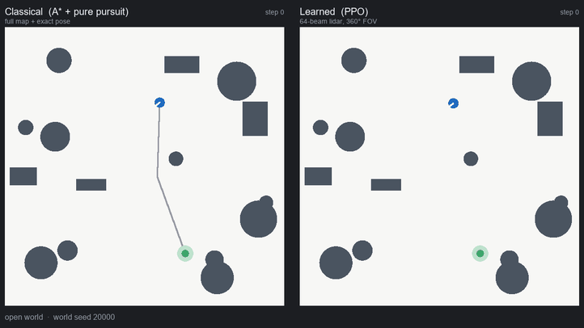

# Learning Vision-Conditioned Navigation Policies

[](https://github.com/ardhendudebnath/vision-rl-navigation/actions/workflows/ci.yml)

### A comparative study against classical planning



*Left: A\* + pure pursuit with the full map. Right: PPO from a 64-beam lidar.
Same world, same clock. Six held-out episodes across open, cluttered and
tight-corridor worlds. Grey: the global plan (classical only — the learned
policy has no plan to draw). Orange: the executed trajectory.
[Full-quality MP4](results/demo_comparison.mp4).*

**The episodes are stratified to match the measured outcome rates, not
hand-picked wins.** Taking the first six seeds in order gave six successes for
both actors, which misrepresents a policy measured at 0.70 success on
`narrow`. In this clip the learned policy succeeds in 4 of 6 (0.67, against
0.70–0.73 measured) and the classical planner in 5 of 6 (0.83, against
0.85–0.89) — including one world where **the classical planner is the one that
crashes**. Every seed is listed in
[`scripts/make_comparison_video.py`](scripts/make_comparison_video.py) so the
selection is reproducible.

---

A reinforcement-learning navigation agent, a classical planning stack, and a
protocol strict enough that comparing them means something.

The question is not "can an RL agent reach a goal" — it is **where a learned
policy beats a strong classical planner, where it loses, and how each one
degrades when the world stops looking like the training set.** Every design
decision below follows from wanting that comparison to be trustworthy.

## Status

| Stage | State |
|---|---|
| Task, metrics, splits, 533-test suite | Done |
| Classical baseline (A* + pure pursuit, full map) | Done |
| Privileged RL, robustness suite, distribution shifts | Done |
| Four explanations for the gap, each tested and rejected | Done |
| Perception: beam count, field of view, coverage vs resolution | Done |
| Vision: depth camera, RGB + CNN encoder | Done |
| Dynamics: moving obstacles, frame stacking | Done |
| Technical report + demo video | Done |
| Real Nav2 over ROS 2, scored as one more actor | Done |
| Frozen-mover subtraction; churn and horizon mechanisms ruled out | Done |
| Faster movers and an explicit velocity channel: both inert | Done |
| The reward prices information: stacking pays at 1:1, not at 4:1 | Done |
| Recurrence: worse everywhere, and the control says not about motion | Done |
| Re-pricing perception at 1:1: the reward flips what resolution does | Done |
| Timeout audit of every perception result: all reproduce; deficits stall, not crash | Done |
| Coverage re-priced at 1:1: headline survives, mechanism moves stall to crash | Done |
| Motion cost traced to planning: oracle prediction, space-time planning, a temporal margin — ~0 given exact trajectories | Done |
| With a real estimate instead: about half survives, and four changes to how the planner uses it recover none of the rest | Done |
| Fitting the mover's oscillation from observation: recovers all of it and matches the oracle — the model was the problem | Done |
| Noise on the observations: a centimetre costs more than the model bought, and only then does the model class stop mattering | Done |
| Fitting without differencing: the filter closes the gap — from the robot's own noisy observations, indistinguishable from an oracle | Done |
| Seeing only what a sensor could: a 360° scanner costs little, a 90° camera nearly everything | Done |
| The planner builds its own map: open worlds unchanged, and the clutter margin over the policy gone | Done |
| And estimates its own pose: free in clutter, ruinous in open worlds — the exact inverse of the map | Done |
| Nav2 with SLAM, asked the same: as costly with the same scanner, a seventh of it with a dense one | Done |
| And this stack at 360 beams: the sensor fixes its pose, not its map | Done |
| A mapper that asks a cell's returns to corroborate each other: the noise regression repaired | Done |
| Encoder cost re-priced at 1:1: survives (−0.180 narrow), and still fails by stalling | Done |
| Why the pixel policy stalls: the image carries the depth, and a velocity latch holds the stall — released, it crashes | Done |
| And what its features lack: the clearance ahead is there, the width of the gap past it is not | Done |
| *(Next)* Isaac Lab; sim-to-real | Not started |

Sixty experiments, each pre-registered where it tests a hypothesis. The
phase-by-phase record, including every prediction that failed and three
successive corrections to the same claim, is in
[`docs/project_plan.md`](docs/project_plan.md).

**Technical report: [`docs/report.md`](docs/report.md)** — the full study written
up as a short paper, including the false positive this project caught in its
own results and how. Phase-by-phase detail and rationale:
[`docs/project_plan.md`](docs/project_plan.md). In a hurry:
[`docs/one_page_summary.md`](docs/one_page_summary.md). The moving-obstacle
thread — eight phases and three successive corrections to the same claim — is
written up separately in
[`docs/dynamic_obstacles.md`](docs/dynamic_obstacles.md).

## Results

Success rate on 100 held-out worlds per condition. All actors see **identical
worlds in identical order**, asserted at evaluation time. Learned arms are
6 training seeds; the classical planner is deterministic and gets its best
configuration on every condition.

| Condition | Classical | Best learned | Δ | Significant? |
|---|---|---|---|---|
| nominal | **1.000** | 0.937 ± 0.021 | −0.063 | yes |
| sparse | **1.000** | 0.980 | −0.020 | — |
| large | **1.000** | 0.970 | −0.030 | — |
| dense | **0.890** | 0.730 | −0.160 | yes |
| narrow | **0.850** | 0.682 ± 0.060 | −0.168 | yes |
| **dynamic** | **0.880** | 0.860 ± 0.033 | **−0.020** | **no** (p = 0.219) |
| dynamic_dense | **0.820** | 0.710 ± 0.042 | −0.110 | yes (p = 0.031) |

Full tables: [`results/benchmark.md`](results/benchmark.md). The classical
planner is given the full obstacle map and exact pose throughout — a baseline
that loses through handicap proves nothing.

**The hand-written baseline was checked against the real thing.** Nav2 1.3.12
on ROS 2 Jazzy runs as one more actor over the same worlds in the same order
([`ros2_bridge/`](ros2_bridge/)), two independent passes because Nav2 is
asynchronous and does not reproduce itself exactly.

| Condition | Classical (hand-written) | Nav2 | Δ |
|---|---|---|---|
| nominal | 1.000 | 0.970–0.980 | −0.030 to −0.020 |
| sparse | 1.000 | 0.990 | −0.010 |
| large | 1.000 | 0.990 | −0.010 |
| noisy_lidar | 1.000 | 0.970–0.980 | −0.030 to −0.020 |
| dense | 0.890 | 0.910–0.940 | +0.020 to +0.050 |
| narrow | 0.850 | 0.910–0.930 | +0.060 to +0.080 |

The two agree to within 0.03 wherever clutter is not the binding constraint.
On `narrow` Nav2 is ahead in both passes, so the `narrow` gap above is a
*lower bound* on the gap to a production stack; `dense` leans the same way
without clearing the noise band.

The gain is a collision reduction — 58–92% on `narrow`, 56–78% on `dense` —
and that is the failure mode the report had already diagnosed by counting how
the baseline fails: A\* never once fails to plan, and most losses are the
controller leaving the path while cornering. On `dense` those recovered
episodes turn into timeouts rather than successes, which is why the mechanism
replicates on both conditions and the success rate does not. Details,
including the costmap bug that made this experiment report the opposite before
it was fixed: [`results/nav2_comparison.md`](results/nav2_comparison.md) and
§4.1 of the report.

### Four findings

**1. The classical planner wins, and not for any of the usual reasons.**
Insufficient data, wrong training distribution, insufficient compute (tested
twice, to 2.7× budget), and reward mis-specification were each tested and
rejected. What remains is behavioural: the reward makes a collision cost 4×
a timeout, so the policy correctly learns to stall rather than crash. It
converges on caution — collisions fall 27 → 2 per 100 episodes while 21 of
those 25 recovered episodes become timeouts, not successes.

**2. Sensor coverage is causal; angular resolution is not.** A training-free
audit of the sensor predicted this before any policy was trained, then
forecast two subsequent training experiments to within 0.021 and 0.001.
Doubling the sample count at fixed field of view changes nothing in success (+0.002,
−0.003, inside a pre-registered ±0.01 bound); quadrupling coverage at
identical resolution produces the entire effect (+0.095, p = 0.024).

**3. The pixels are the problem, not the geometry.** Rendering the *same*
geometry as images for a CNN, rather than reading it as a vector, costs
0.16–0.24 success on every condition — every depth seed beats every RGB seed.
The gap survives giving RGB 2.7× the compute.

**4. Where the map is wrong, the gap narrows to parity — with sparse movers
only, and for an unflattering reason.** With obstacles that move and are
absent from the map, the learned policy is statistically indistinguishable
from the planner on `dynamic` (−0.020, p = 0.219) while staying clearly worse
where the map is right (−0.168, p = 0.031). Frame stacking, the one setup
giving the policy information the planner structurally lacks, changed nothing
(−0.008, p = 0.784), still nothing when the movers are made three times faster
so they outrun the robot (−0.027), and still nothing when the velocity is
handed over explicitly as a per-beam range delta.

**The reward was hiding it.** A collision costs 20 and a full timeout costs 5,
so crashing is 4× worse than stalling. Make them exactly equal and frame
stacking works: **+0.033, p = 0.019, 6 of 6 seeds**, and nothing on the slow
control. Stacking cuts collisions under *both* rewards — the information was
always being used. At 4:1 the saving is swallowed by timeouts nearly doubling;
at indifference it becomes successes. The reward does not decide whether the
policy can anticipate, it decides what anticipation is *for*.

Three follow-ups cut that claim down, each pushing the same way. Adding
clutter to the movers removes it: on `dynamic_dense` real Nav2 is **0.150–
0.170 ahead of the learned policy and above all six training seeds**. Giving
the hand-written baseline its genuinely best replanning policy — rebuild only
when the path is blocked, not on a timer — removes it there too (−0.110,
p = 0.031, where the timed baseline had shown −0.040 and no significance).

And a controlled subtraction — the same worlds with the movers **parked**,
still absent from the map, only the motion removed — shows what the remaining
parity is made of. Frozen, the classical advantage returns and widens (−0.100
and −0.202, both p = 0.031, 0/6 seeds). Motion costs the planner 0.120–0.160
and the learned policy only 0.048–0.068. The policy is behind in *every*
regime; it is just harder to disrupt, because one that never commits to a path
has no plan to invalidate. Robustness by absence of commitment — not the
competence the original framing implies.

### The part worth reading

**A correctly computed significance test produced a confident, reproducible,
wrong conclusion.** A 64-beam lidar result looked significant on one seed per
arm (+0.070, 95% CI [+0.006, +0.134]). Across four seeds it vanished (+0.042,
p = 0.457), and its headline collision improvement turned out to be pure seed
luck.

The interval was not miscalculated. Pairing over *episodes* correctly answers
"do these two policies differ on these worlds" — but the question that matters
treats the **training seed** as the unit, and the episode test was silent on
the dominant source of variance. A correct answer to the wrong question, which
is much harder to notice than an error.

Everything after that point uses seed-level analysis, exact permutation tests,
and pre-registered endpoints. Two later predictions derived from *measured*
quantities held to within 0.021; two derived from intuition were wrong by 2–3×.

Full write-up, including three more results and every caveat:
**[`docs/report.md`](docs/report.md)**.

## Quickstart

```bash
python -m venv .venv && .venv/Scripts/activate   # Linux/macOS: source .venv/bin/activate
pip install -e ".[dev,viz]"
pytest
```

Evaluate the classical baseline on held-out worlds:

```bash
python -m vision_nav.training.evaluate --actor classical --split test --episodes 100
```

Check the training pipeline end to end (about two minutes, CPU):

```bash
python -m vision_nav.training.train --config-name smoke
```

Train the privileged-RL agent properly:

```bash
python -m vision_nav.training.train
```

Train with domain randomisation, or continue an existing run:

```bash
python -m vision_nav.training.train env=nav_dr train.run_name=ppo_dr
```

```bash
python -m vision_nav.training.train env=nav_dr train.run_name=ppo_dr_long train.total_timesteps=2500000 train.resume_from=runs/ppo_dr/final_model.zip
```

Run the full comparison matrix and write the results table:

```bash
python scripts/run_benchmark.py --rl nominal=runs/ppo_privileged/best_model.zip dr=runs/ppo_dr/best_model.zip
```

Render the side-by-side comparison video (MP4 + GIF):

```bash
python scripts/make_comparison_video.py --rl runs/beams64/best_model.zip --out results/demo_comparison
```

Render a single-actor GIF:

```bash
python scripts/make_demo.py --world 20000 --worlds 3 --out results/demo.gif
```

## The task

A differential-drive robot must reach a goal pose in a procedurally generated
12x12 m arena of circular and box obstacles, using a 32-beam planar lidar and
a goal vector. Worlds are generated from an integer seed and are **guaranteed
solvable** — start and goal are collision-free, at least 5 m apart, and
verified connected before the episode begins.

That guarantee is load-bearing. If some episodes were impossible, a failure
would be ambiguous between "bad policy" and "bad task", and success rate and
SPL would both stop meaning anything.

**Observation** (37-d): 32 normalised lidar ranges, goal distance, goal
bearing as `(cos, sin)`, current linear and angular velocity.
**Action** (2-d, continuous): normalised `(v, omega)` — deliberately the same
interface as `geometry_msgs/Twist`, so a real ROS 2 base is a transport change
rather than a policy rewrite.

## Metrics

Success rate, **SPL**, collision rate, timeout rate, steps to goal, and path
efficiency. SPL follows Anderson et al. (2018), *On Evaluation of Embodied
Navigation Agents*, so the numbers are comparable to published work rather
than being project-specific scores.

Two details that turned out to matter more than expected:

- **`l*` is string-pulled before use.** A raw 8-connected A* path
  overestimates the true geodesic distance, and an overestimated `l*` makes
  `l* / max(p, l*)` clamp to 1.0 for any competent policy — SPL quietly stops
  discriminating between good and great. Line-of-sight shortcutting fixes it,
  and the effect is measurable: baseline path efficiency went from exactly
  1.000 (saturated, useless) to 0.993 (real).
- **Mean steps-to-goal averages successes only.** Including failures would let
  a policy look fast by crashing early.

## Design decisions worth arguing about

**Reward shaping is geodesic, not Euclidean.** Progress reward uses an A*
distance field. Euclidean shaping creates a local optimum behind every
obstacle: the agent gets paid to press into a wall that happens to lie between
it and the goal. The distance field is *training-time* privileged information
— it never enters the observation, so the policy remains honestly sensor-only
at evaluation. `reward.use_geodesic_progress=false` keeps the ablation
available.

**Model selection uses validation SPL, not training return.** Return is shaped
and not comparable across configurations. Selecting on the metric the report
actually presents avoids picking a checkpoint that learned to farm the shaping
term instead of navigating.

**The classical baseline is given every advantage.** Full obstacle map, exact
pose. A baseline that loses because it was handicapped proves nothing.

## Repository layout

```
src/vision_nav/
  envs/        World generation, robot kinematics, lidar, the Gymnasium task
  planning/    A*, geodesic distance fields, path smoothing
  agents/      Classical A* + pure-pursuit baseline
  metrics/     Success rate, SPL, collisions, path efficiency
  training/    PPO training, evaluation harness, the shared actor interface
  viz/         Top-down renderer for figures and demo videos
configs/       Hydra configs (env / algo / train)
scripts/       Benchmark matrix, demo rendering
tests/         75 tests over geometry, planning, env contract and metrics
docs/          Project plan, decisions and status
```

## Hardware

Developed on a laptop RTX 5070 Ti (12 GB VRAM), which is **below** Isaac Sim's
documented 16 GB minimum. The simulator here is deliberately lightweight
(pure NumPy, analytic geometry, ~2,000 env steps/s on CPU) so the full
pipeline can be built and debugged locally, with Isaac Lab / Habitat runs
reserved for rented GPU time. The task definition, metrics, splits and
evaluation harness all carry over unchanged when the simulator swaps.

## License

MIT — see [LICENSE](LICENSE).
